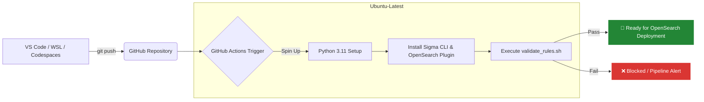

# 🛡️ Detection-as-Code (DaC) Automation Pipeline

## 🚀 Project Overview
An automated, cloud-native Detection-as-Code (DaC) CI/CD pipeline that validates, tests, and prepares Sigma detection rules for production deployment. This project automates syntax linting and query compilation using the OpenSearch Lucene backend, ensuring zero-day misconfigurations never reach production SIEM environments.

---

## 🛠️ Architecture & Flow

This pipeline provides an automated lifecycle for security analytics, moving rules seamlessly from an engineer's IDE to a validated state ready for ingestion.



# 🛡️ Detection-as-Code (DaC) Automation Pipeline

## 🚀 Project Overview
An automated, cloud-native Detection-as-Code (DaC) CI/CD pipeline that validates, tests, and prepares Sigma detection rules for production deployment. This project automates syntax linting and query compilation using the OpenSearch Lucene backend, ensuring zero-day misconfigurations never reach production SIEM environments.

---

## 🛠️ Architecture & Flow

This pipeline provides an automated lifecycle for security analytics, moving rules seamlessly from an engineer's IDE to a validated state ready for ingestion.

```mermaid
graph LR
    A[VS Code / WSL / Codespaces] -- git push --> B(GitHub Repository)
    B --> C{GitHub Actions Trigger}
    subgraph CI/CD Runner Environment [Ubuntu-Latest]
        C -- Spin Up --> D[Python 3.11 Setup]
        D --> E[Install Sigma CLI & OpenSearch Plugin]
        E --> F[Execute validate_rules.sh]
    end
    F -- Pass --> G[🚀 Ready for OpenSearch Deployment]
    F -- Fail --> H[❌ Blocked / Pipeline Alert]

    style G fill:#238636,stroke:#fff,stroke-width:2px,color:#fff
    style H fill:#da3633,stroke:#fff,stroke-width:2px,color:#fff
