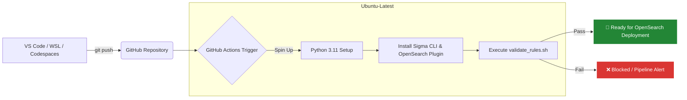

# 🛡️ Detection-as-Code (DaC) Automation Pipeline

## 🚀 Project Overview
An automated, cloud-native Detection-as-Code (DaC) CI/CD pipeline that validates, tests, and prepares Sigma detection rules for production deployment. This project automates syntax linting and query compilation using the OpenSearch Lucene backend, ensuring zero-day misconfigurations never reach production SIEM environments.

---

## 🛠️ Architecture & Flow

This pipeline provides an automated lifecycle for security analytics, moving rules seamlessly from an engineer's IDE to a validated state ready for ingestion.

The Lifecycle Stages:
Authoring: Detection engineers write rules in standardized YAML/Sigma format using VS Code, WSL, or GitHub Codespaces environments.

Validation (CI): GitHub Actions automatically triggers a clean runner environment on every push or pull_request targeting the main branch.

Compilation: An isolated pySigma environment spins up, runs a thorough syntax verification matrix, and test-compiles the rule logic explicitly against the opensearch_lucene target backend.

⚙️ CI/CD Pipeline Implementation (The "How")
The Challenge
Transitioning validation and compilation logic from generic or legacy security engines to highly specific target OpenSearch-compliant queries. During development, default compilers strictly require centralized processing pipelines for log-source mapping, which routinely breaks local validation suites and halts decoupled engineering workflows.

The Solution
Designed and implemented a modular validation script (validate_rules.sh) coupled with a streamlined GitHub Actions continuous integration workflow. By explicitly executing compilation tests with the --without-pipeline flag, the pipeline successfully isolates and validates core detection logic independently from platform-specific delivery pipelines.

💻 Getting Started & Local Validation
To demonstrate the high reproducibility of this Detection-as-Code pipeline, you can run the validation suite locally within any Linux/WSL environment or a VS Code Dev Container.

1. Prerequisites
Ensure you have Python 3.11+ installed, then set up the required Sigma tooling and dependencies:

Bash
# Install core Sigma CLI and the OpenSearch backend plugin
pip3 install sigma-cli
sigma plugin install opensearch
2. Running the Validation Script
Execute the automated test script to scan the local directory, lint YAML configurations, and test-compile the rules into active OpenSearch queries:

Bash
# Grant execution permissions and run the validator
chmod +x ./validate_rules.sh
./validate_rules.sh
3. Expected Output
A successful validation workflow cleanly parses the detection logic and yields a definitive success block:

Plaintext
==========================================
🛡️  Running Sigma Detection Validation 🛡️
==========================================
🔍 Scanning for Sigma rules...
------------------------------------------
📄 Checking: detections/aws/s3_public_bucket.yml
✅ Syntax: Valid
⚙️  Testing OpenSearch Lucene compilation...
Parsing Sigma rules
🚀 Compilation: Successful
==========================================
🎉 All rules passed validation successfully!
==========================================
